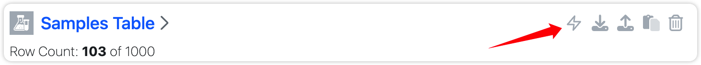
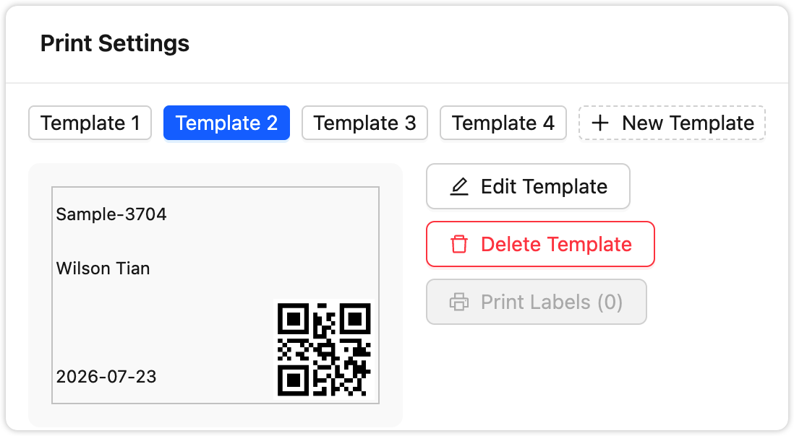

# Signals Notebook Extension

A Chrome extension that adds batch label printing capabilities to Signals Notebook.

## Installation

[Install from Chrome Web Store](https://chrome.google.com/webstore/detail/fiiehoaijdnnonolcjogmjhpmjjlnglp)

After installation, configure your Signals Notebook host:
1. Click the extension icon in Chrome toolbar
2. Open Options
3. Add your SNB host(s) (e.g., `your-instance.signalsresearch.revvitycloud.com`)

## Sample Label Printing

Design and print custom labels for your samples directly from Signals Notebook.

### How to Use

1. Navigate to a **Samples Container** in Signals Notebook
2. Click the **"Sample Tools"** button in the toolbar
3. Select the samples you want to print labels for
4. Configure your label template in the modal:
   - Choose from saved templates or create a new one
   - Edit template layout, add fields, QR codes, barcodes
   - Preview labels with actual sample data
5. Click **"Print Labels"** to generate and print

### Template Editor

Design labels with a visual grid editor:

- **Flexible Layout**: Set label dimensions and grid structure
- **Multiple Elements**: Add text fields, QR codes, barcodes, and static text
- **Data Binding**: Insert sample properties or user information
- **Customizable Styling**: Adjust font sizes, alignment, and date formats
- **Template Library**: Save up to 5 templates with drag-and-drop reordering

---

*For development documentation, see [CONTRIBUTING.md](CONTRIBUTING.md).*
